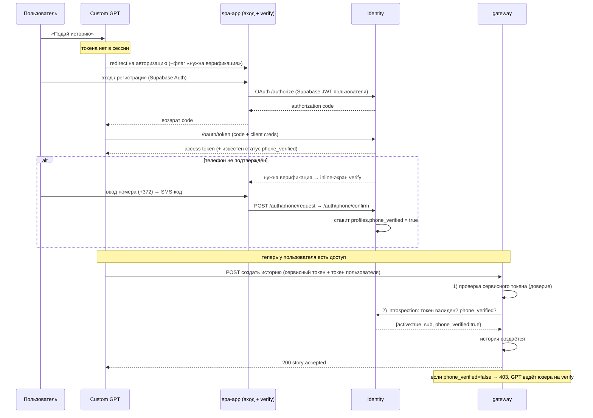

# 04. Безопасность и авторизация

## О чём этот документ

Здесь два пласта. Первый — **строительные блоки безопасности**, которые уже реально работают в коде (проверка токенов, защита строк в БД, хэширование персональных данных). Второй — **подробный разбор того, как должна работать авторизация целиком**: от момента, когда пользователь в ChatGPT захотел подать историю, до момента, когда gateway убедился, что этот человек существует и прошёл eID. Второй пласт — это согласованная целевая модель (решения от 2026-06-04); по ходу честно помечаю, что из неё уже в коде, а что пока заглушка.

---

# Часть A. Как устроена авторизация (целевой процесс)

## Действующие лица

- **Пользователь** — человек в ChatGPT.
- **GPT** — Custom GPT (действует как OAuth-клиент).
- **UI (spa-app)** — веб-приложение, внутри него живёт страница авторизации/входа.
- **identity** — наш сервис: вход, выдача токена, eID-статус.
- **eID-провайдер** — внешний сервис проверки личности (Authentigate / eID Easy; сейчас — mock).
- **gateway** — `doge-complaints-gateway`, где реально создаются истории.

## Главный принцип: два независимых вопроса

Когда gateway получает «создай историю», он должен ответить на **два разных** вопроса, и это два разных слоя защиты:

1. **«Меня зовёт доверенный сервис или кто попало?»** → решается **сервисным токеном** (или mTLS). Это межсервисное доверие.
2. **«Кто этот человек и прошёл ли он верификацию (телефон)?»** → решается **проверкой пользовательского токена у identity** (introspection). Это идентичность пользователя.

> **Phone-pivot (2026-06):** активный гейт — `phone_verified` (разовая верификация по SMS-OTP). eID **отложен** (доп. расходы SK) — eID-разделы ниже сохранены как DEFERRED. Источник: [`phone-verification-architecture-2026-06-10`](../analysis/phone-verification-architecture-2026-06-10.md).

Сервисный токен сам по себе **не** доказывает, какой пользователь стоит за запросом — поэтому нужны оба слоя. Если довериться только сервисному токену, появляется классическая дыра «confused deputy» (подача истории от имени кого угодно), а для платформы, где смысл в проверенной личности, это недопустимо.

## Sequence-диаграмма (подача истории из GPT)

> **as-is vs target:** диаграмма — **целевая**. Сейчас (as-is): OAuth-маршруты `/oauth/*` — **✅ построены** ([OAUTH-01](../tasks/backlog-stories/oauth/STORY-IDS-OAUTH-01-oauth-server-endpoints.md)); introspection-endpoint **`POST /oauth/introspect`** — **✅ построен** ([OAUTH-02](../tasks/backlog-stories/oauth/STORY-IDS-OAUTH-02-introspection-and-service-token.md)); сервисный gate — `SERVICE_API_TOKEN` / `ServiceTokenAuth` (обязателен в `APP_PROFILE=pilot`). Durable handshake/codes в Supabase — **✅ построен** при `DB_BACKEND=supabase` ([OAUTH-03](../tasks/backlog-stories/oauth/STORY-IDS-OAUTH-03-persistent-token-store-supabase.md)); demo/offline-тесты — `in_memory`. Gateway пока **не зовёт** identity (intake открыт). Телефонная верификация (`/auth/phone/*`, `/me`) — **построена**. Оставшийся разрыв: verify-gate ([OAUTH-04](../tasks/backlog-stories/oauth/STORY-IDS-OAUTH-04-verify-gate-and-verification-required.md)).

## Тот же процесс словами (по шагам)

1. **Пользователь просит GPT подать историю.** У GPT нет токена доступа.
2. **GPT отправляет пользователя на страницу входа** внутри spa-app — как любой OAuth-клиент, когда нет сессии. Передаётся флаг, что действие требует **верификации** (потому что это отправка истории).
3. **Пользователь входит или регистрируется** (через Supabase Auth внутри UI).
4. **identity проводит OAuth-обмен** (`/oauth/authorize` → `/oauth/token`) и выдаёт GPT **access-токен**. При этом identity знает статус `phone_verified` пользователя.
5. **Если телефон не подтверждён** — пользователю показывают inline-экран верификации (ввод номера +372 → SMS-код, `/auth/phone/request` → `/auth/phone/confirm`), и identity ставит `profiles.phone_verified = true`. (Внешний redirect не нужен — это наши же API.)
6. **GPT получает токен** и теперь **сам шлёт запрос на создание истории напрямую в gateway** — контент истории через identity не проходит.
7. **gateway проверяет два слоя:** сначала сервисный токен (это доверенный вызов), затем дёргает identity (**introspection**), чтобы убедиться: токен живой, и `phone_verified = true`.
8. **Если всё ок — история создаётся.** Если телефон не подтверждён — gateway отвечает 403 (`verification_required`), и GPT подсказывает пользователю пройти верификацию.

## Что из этого уже в коде, а что нет

| Шаг | Где в коде | Статус |
|-----|-----------|--------|
| Проверка Supabase JWT пользователя | [`auth/supabase_validator.py`](../../src/core/auth/supabase_validator.py) | ✅ |
| **`/me`** (профиль + `phone_verified`) | [`me_response.py`](../../src/core/api/me_response.py), [`asgi_app.py:235`](../../src/core/api/asgi_app.py) | ✅ построен (AUTHCORE-01) |
| **Телефонная верификация** `/auth/phone/request|confirm` | [`asgi_app.py:286,302`](../../src/core/api/asgi_app.py), `core/phone/` | ✅ (PV-01…07) |
| OAuth-движок (код/токен/PKCE) | [`repositories.py:430`](../../src/core/infrastructure/repositories.py) (in-memory), [`db_supabase.py`](../../src/core/infrastructure/db_supabase.py) (Supabase при `DB_BACKEND=supabase`) | ✅ |
| OAuth-маршруты `/oauth/authorize`, `/oauth/authorize/complete`, `/oauth/token` | [`asgi_app.py:368-403`](../../src/core/api/asgi_app.py), [`core/oauth/handlers.py`](../../src/core/oauth/handlers.py) | ✅ построен ([OAUTH-01](../tasks/backlog-stories/oauth/STORY-IDS-OAUTH-01-oauth-server-endpoints.md)) |
| Durable handshake/codes (Supabase Postgres) | [`SupabaseAuthorizationRequestStore`](../../src/core/infrastructure/db_supabase.py), [`SupabaseOAuthTokenService`](../../src/core/infrastructure/db_supabase.py), миграция [`20260624000001_oauth_authorization_tables.sql`](../../supabase/migrations/20260624000001_oauth_authorization_tables.sql) | ✅ при `DB_BACKEND=supabase` ([OAUTH-03](../tasks/backlog-stories/oauth/STORY-IDS-OAUTH-03-persistent-token-store-supabase.md)); demo — in-memory |
| eID-старт/callback (`/auth/eid/start`, `/auth/{provider}/callback`) | [`asgi_app.py`](../../src/core/api/asgi_app.py), [`rate_limit_dependency.py`](../../src/core/api/rate_limit_dependency.py) | ✅ HTTP rate-limit (SEC-01, pkg-000035) |
| Флаг «нужна верификация» в сессии | поля `return_context`/`requested_action` в [`models.py`](../../src/core/domain/models.py) | ⚪ поля есть; relay через OAuth = [OAUTH-04](../tasks/backlog-stories/oauth/STORY-IDS-OAUTH-04-verify-gate-and-verification-required.md) |
| **introspection-endpoint** для gateway (`{active, sub, phone_verified}`) | [`introspection.py`](../../src/core/oauth/introspection.py), [`asgi_app.py:407-416`](../../src/core/api/asgi_app.py) | ✅ построен ([OAUTH-02](../tasks/backlog-stories/oauth/STORY-IDS-OAUTH-02-introspection-and-service-token.md)) |
| Проверка сервисного токена на входе identity | `AppConfig.service_api_token` ([`schema.py:70,238`](../../src/core/config/schema.py)), `ServiceTokenAuth` ([`security.py:89-116`](../../src/core/api/security.py)); **обязателен в pilot** | ✅ (gate disabled в demo при пустом токене) |

То есть телефонная верификация, `/me`, OAuth-маршруты, **introspection+сервисный gate** и **durable handshake/codes при `DB_BACKEND=supabase`** **построены**; gateway intake ещё не подключён. При `DB_BACKEND=in_memory` (demo/offline-тесты) handshake/codes остаются in-memory. eID — отложен (mock остаётся как provider-каркас).

---

# Часть B. Строительные блоки безопасности (что уже работает)

## 1. Проверка личности пользователя — Supabase JWT ✅

`SupabaseJwtValidatorImpl` ([`supabase_validator.py:12-45`](../../src/core/auth/supabase_validator.py)): библиотека `joserfc`, алгоритм **HS256** на секрете `SUPABASE_JWT_SECRET`. Обязательно сходятся: издатель `iss == {SUPABASE_URL}/auth/v1`, наличие `sub` и `exp`, и роль `authenticated`. Иначе — `JwtValidationError`. Покрыто тестами на типовые атаки: просрочка, чужая подпись, `alg=none`, неверный издатель.

## 2. Пропуск на входе — Bearer ✅

`get_current_user` ([`security.py:65-70`](../../src/core/api/security.py)) достаёт `Authorization: Bearer <токен>` и валидирует через `SupabaseJwtBearerTokenAuth` ([`security.py:34-45`](../../src/core/api/security.py)). Нет/битый токен → 401. Есть также неиспользуемый `StubBearerTokenAuth` ([`security.py:22-31`](../../src/core/api/security.py)) — ⚪ наследие ранних эпиков.

## 3. OAuth-движок ✅ (логика + наружу)

`InMemoryOAuthTokenService` ([`repositories.py:430+`](../../src/core/infrastructure/repositories.py)) и `SupabaseOAuthTokenService` ([`db_supabase.py`](../../src/core/infrastructure/db_supabase.py)) умеют: выдать authorization code с TTL, обменять его на access-токен, проверить **PKCE S256**, подписать self-signed JWT (HS256) через [`access_token_jwt.py`](../../src/core/oauth/access_token_jwt.py). **`client_secret` проверяется** через [`verify_client_secret`](../../src/core/oauth/client_secret.py). Наружу подключён через [`core/oauth/handlers.py`](../../src/core/oauth/handlers.py) и маршруты [`asgi_app.py:368-403`](../../src/core/api/asgi_app.py). **Handshake/codes:** durable в Supabase при `DB_BACKEND=supabase` ([OAUTH-03](../tasks/backlog-stories/oauth/STORY-IDS-OAUTH-03-persistent-token-store-supabase.md) ✅); demo/offline — in-memory.

## 4. Защита персональных данных — HMAC ✅

`hash_secret(plaintext, key)` ([`hashing.py:9-11`](../../src/core/security/hashing.py)) — HMAC-SHA256, ключ передаётся явно. Используется для `verified_person_hash` (необратимый «отпечаток» человека). Сам сервис **не хранит** имя/код/дату рождения/сырые токены — только производный хэш.

## 5. Защита строк в БД — RLS ✅

Во всех таблицах включён Row Level Security. У `profiles` — политики «вижу/меняю только своё» через `auth.uid()` ([миграция:59-77](../../supabase/migrations/20260525000001_create_profiles.sql)); у служебных таблиц — доступ только сервисной роли. Нюанс изоляции (service_role обходит RLS на весь проект) — причина держать identity в отдельном Supabase-проекте ([separation-audit](../analysis/supabase-project-separation-audit-2026-06-03.md)).

## 6. CORS ✅

[`asgi_app.py:75-80`](../../src/core/api/asgi_app.py): список разрешённых origin'ов из `CORS_ALLOWED_ORIGINS` (в проде — конкретные домены, не `*`).

## 8. HTTP rate limiting (anti-abuse) ✅

Сквозной слой `rate_limit_dependency` ([`rate_limit_dependency.py`](../../src/core/api/rate_limit_dependency.py)) + in-memory store ([`rate_limit.py`](../../src/core/security/rate_limit.py)). Конфиг: `RATE_LIMIT_*` env ([`schema.py`](../../src/core/config/schema.py)). Волна pkg-000035: `POST /auth/eid/start` (5/600s/user), `GET /auth/{provider}/callback` (5/600s/ip). Волна pkg-000036: `POST /auth/phone/request` (5/600s/user, `RATE_LIMIT_PHONE_REQUEST_*`). Превышение → HTTP **429** + `error.code=rate_limit_exceeded` + `retry_after` ([`envelope.py`](../../src/core/api/envelope.py)). **Два слоя на phone/request:** HTTP 429 (сквозной dependency, до handler) vs OTP-cooldown доменный **400** `RATE_LIMITED` внутри handler (`PHONE_RESEND_COOLDOWN_S`); порядок: `Depends(rate_limit)` → `handle_phone_request` → cooldown check. **Callback client IP:** по умолчанию `RATE_LIMIT_TRUSTED_PROXY_COUNT=0` — `X-Forwarded-For` **не доверяется** (ключ `ip:{request.client.host}`); за reverse-proxy выставить число доверенных hop'ов (client = элемент `len(hops) - count - 1` в XFF). Тесты: [`test_rate_limiting.py`](../../tests/test_rate_limiting.py).

## 7. Секреты

`SUPABASE_JWT_SECRET`, `SUPABASE_SERVICE_ROLE`, `OAUTH_ACCESS_TOKEN_SECRET`, `SERVICE_API_TOKEN`, `DOGESTONIA_EID_SECRET` (единый HMAC-секрет), `CODE_VERIFIER_ENCRYPTION_KEY` (AES-256 — ⚪ заявлен, но шифрование verifier в коде пока не используется). В режиме **pilot** отсутствие критичных секретов → сервис не стартует ([`schema.py:173-188`](../../src/core/config/schema.py)).
