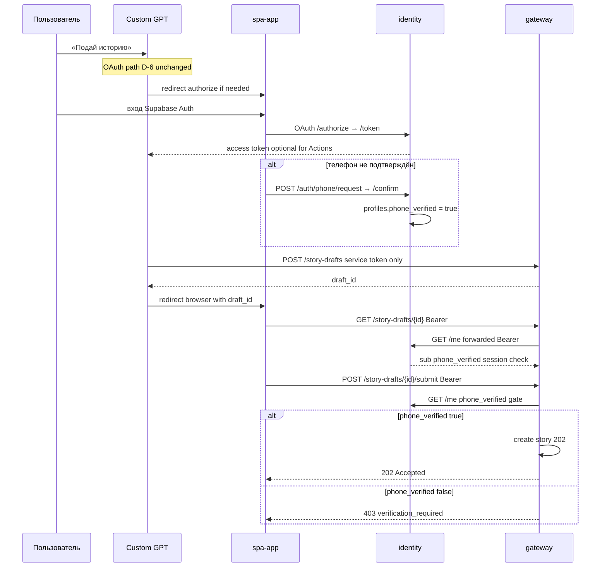

# 04. Безопасность и авторизация

## О чём этот документ

Здесь два пласта. Первый — **строительные блоки безопасности**, которые уже реально работают в коде (проверка токенов, защита строк в БД, хэширование персональных данных). Второй — **подробный разбор того, как должна работать авторизация целиком**: от момента, когда пользователь в ChatGPT захотел подать историю, до момента, когда gateway убедился, что этот человек существует и прошёл верификацию телефона. Второй пласт — согласованная модель: OAuth-преамбула (2026-06-04, D-6) + **browser-submit handoff** (2026-07-04, GW-DRAFT-02); по ходу помечаю as-built vs superseded.

---

# Часть A. Как устроена авторизация (browser-submit + OAuth)

> **Актуализация (2026-07-04, IDS-DOC-DRAFT-05):** продуктовый submit истории — **браузер** через gateway `/story-drafts*`; GPT **стешит** черновик и редиректит в spa. OAuth `/oauth/authorize|token|introspect` **остаётся каноном** для GPT Actions (D-6). As-built gateway: [`API_REFERENCE §6.8`](../../../doge-complaints-gateway/docs/runtime-docs/api-reference/API_REFERENCE.md).

## Действующие лица

- **Пользователь** — человек в ChatGPT.
- **GPT** — Custom GPT (действует как OAuth-клиент).
- **UI (spa-app)** — веб-приложение, внутри него живёт страница авторизации/входа.
- **identity** — наш сервис: вход, выдача токена, eID-статус.
- **eID-провайдер** — внешний сервис проверки личности (Authentigate / eID Easy; сейчас — mock).
- **gateway** — `doge-complaints-gateway`, где реально создаются истории.

## Главный принцип: два независимых вопроса

Когда gateway создаёт историю от имени пользователя, он должен ответить на **два разных** вопроса — но **на разных путях** transport может отличаться:

1. **«Меня зовёт доверенный сервис или кто попало?»** → **сервисный токен** (или mTLS). На пути stash: `POST /story-drafts` (только service token). На browser submit service token **не** требуется — доверие к вызову обеспечивает публичный HTTPS + Bearer пользователя.
2. **«Кто этот человек и прошёл ли он верификацию (телефон)?»** → **проверка у identity**. Продуктовый submit (GW-DRAFT-02): gateway форвардит Supabase Bearer на **`GET /me`** (не локальная JWT-валидация в gateway). OAuth **`POST /oauth/introspect`** остаётся валидным для других потребителей (GPT Actions, legacy intake) — D-6.

> **Phone-pivot (2026-06):** активный гейт — `phone_verified` (разовая верификация по SMS-OTP). eID **отложен** (доп. расходы SK) — eID-разделы ниже сохранены как DEFERRED. Источник: [`phone-verification-architecture-2026-06-10`](../analysis/phone-verification-architecture-2026-06-10.md).

Сервисный токен сам по себе **не** доказывает, какой пользователь стоит за запросом — поэтому browser submit всегда сопровождается проверкой пользователя у identity. Если довериться только сервисному токену на user-facing path, появляется «confused deputy» (подача от имени кого угодно).

## Sequence-диаграмма (browser-submit handoff)

> **as-is (2026-07-04):** OAuth `/oauth/*`, **`POST /oauth/introspect`**, verify-gate relay (`verification_required`), `/me`, phone PV, JWKS Supabase JWT — **✅ построены** в identity. Gateway story-draft handoff (**GW-DRAFT-01/02**) **подключён**: read/submit вызывают identity **`GET /me`** с форвардом Supabase Bearer ([`me_client.py`](../../../doge-complaints-gateway/src/core/identity/me_client.py)). SPA/GPT client redirect — вне этого репо.

## Тот же процесс словами (по шагам)

**OAuth-преамбула (D-6, без изменений):**

1. **Пользователь просит GPT подать историю.** У GPT может не быть OAuth access token.
2. **GPT отправляет пользователя на страницу входа** в spa-app с флагом «нужна верификация» (`requested_action=stories:submit`).
3. **Пользователь входит или регистрируется** (Supabase Auth в UI).
4. **identity проводит OAuth-обмен** (`/oauth/authorize` → `/oauth/token`) и выдаёт GPT access token. Identity знает `phone_verified`.
5. **Если телефон не подтверждён** — inline verify (`/auth/phone/request` → `/auth/phone/confirm`); identity ставит `phone_verified=true`.

**Browser-submit handoff (актуальный user path, GW-DRAFT-02):**

6. **GPT стешит черновик** в gateway: `POST /story-drafts` (только service token, тело = `StoryIntakeRequest`) → **`draft_id`**. Контент через identity **не** проходит.
7. **GPT редиректит браузер** (spa) на handoff URL с `draft_id`.
8. **Браузер читает черновик:** `GET /story-drafts/{draft_id}` с Supabase Bearer; gateway форвардит Bearer → identity **`GET /me`** (проверка активной сессии, без гейта `phone_verified` на read).
9. **Браузер сабмитит:** `POST /story-drafts/{draft_id}/submit` с тем же Bearer; gateway снова **`GET /me`** → гейт `phone_verified=true` → **202** + создание истории; `false` → **403** `verification_required` + `verify_url`; identity недоступен → **503** (fail-closed).

### Superseded (исторический GPT-direct submit)

> **Superseded GW-DRAFT-03:** ранее канон описывал, что **GPT сам шлёт** запрос создания истории в gateway (`POST /intake/stories` или аналог) с **сервисным + OAuth user token**, а gateway проверял пользователя через **`POST /oauth/introspect`**. Этот путь **не** является продуктовым user submit после story-draft handoff. Operator/service intake с service token может оставаться — см. gateway [`security-env-api-access.md §4`](../../../doge-complaints-gateway/docs/runtime-docs/security-env-api-access.md).

## Что из этого уже в коде, а что нет

| Шаг | Где в коде | Статус |
|-----|-----------|--------|
| Проверка Supabase JWT пользователя | [`auth/supabase_validator.py`](../../src/core/auth/supabase_validator.py) | ✅ |
| **`/me`** (профиль + `phone_verified`) | [`me_response.py`](../../src/core/api/me_response.py), [`asgi_app.py:235`](../../src/core/api/asgi_app.py) | ✅ построен (AUTHCORE-01) |
| **Телефонная верификация** `/auth/phone/request|confirm` | [`asgi_app.py:286,302`](../../src/core/api/asgi_app.py), `core/phone/` | ✅ (PV-01…07) |
| OAuth-движок (код/токен/PKCE) | [`repositories.py:430`](../../src/core/infrastructure/repositories.py) (in-memory), [`db_supabase.py`](../../src/core/infrastructure/db_supabase.py) (Supabase при `DB_BACKEND=supabase`) | ✅ |
| OAuth-маршруты `/oauth/authorize`, `/oauth/authorize/complete`, `/oauth/token` | [`asgi_app.py:368-403`](../../src/core/api/asgi_app.py), [`core/oauth/handlers.py`](../../src/core/oauth/handlers.py) | ✅ построен ([OAUTH-01](../tasks/backlog-stories/oauth/STORY-IDS-OAUTH-01-oauth-server-endpoints.md)) |
| Durable handshake/codes (Supabase Postgres) | [`SupabaseAuthorizationRequestStore`](../../src/core/infrastructure/db_supabase.py), [`SupabaseOAuthTokenService`](../../src/core/infrastructure/db_supabase.py), миграция [`20260624000001_oauth_authorization_tables.sql`](../../supabase/migrations/20260624000001_oauth_authorization_tables.sql) | ✅ при `DB_BACKEND=supabase` ([OAUTH-03](../tasks/backlog-stories/oauth/STORY-IDS-OAUTH-03-persistent-token-store-supabase.md)); demo — in-memory |
| eID-старт/callback (`/auth/eid/start`, `/auth/{provider}/callback`) | [`asgi_app.py`](../../src/core/api/asgi_app.py), [`rate_limit_dependency.py`](../../src/core/api/rate_limit_dependency.py) | ✅ HTTP rate-limit (SEC-01, pkg-000035) |
| Флаг «нужна верификация» в сессии | поля `return_context`/`requested_action` в [`models.py`](../../src/core/domain/models.py) | ✅ relay через OAuth ([OAUTH-04](../tasks/backlog-stories/oauth/STORY-IDS-OAUTH-04-verify-gate-and-verification-required.md)) |
| **introspection-endpoint** (`{active, sub, phone_verified}`) | [`introspection.py`](../../src/core/oauth/introspection.py), [`asgi_app.py:407-416`](../../src/core/api/asgi_app.py) | ✅ ([OAUTH-02](../tasks/backlog-stories/oauth/STORY-IDS-OAUTH-02-introspection-and-service-token.md)); D-6 — канон для GPT Actions |
| Gateway story-draft → identity **`GET /me`** | as-built gateway [`me_client.py`](../../../doge-complaints-gateway/src/core/identity/me_client.py), [`API_REFERENCE §6.8`](../../../doge-complaints-gateway/docs/runtime-docs/api-reference/API_REFERENCE.md) | ✅ на стороне gateway (GW-DRAFT-02) |
| Проверка сервисного токена на входе identity | `AppConfig.service_api_token` ([`schema.py:70,238`](../../src/core/config/schema.py)), `ServiceTokenAuth` ([`security.py:89-116`](../../src/core/api/security.py)); **обязателен в pilot** | ✅ (gate disabled в demo при пустом токене) |

Identity-side: телефонная верификация, `/me`, OAuth, introspection, verify-gate и durable handshake/codes при `DB_BACKEND=supabase` **построены**. Gateway **вызывает** identity `/me` на story-draft read/submit. При `DB_BACKEND=in_memory` (demo) handshake/codes — in-memory. eID — отложен (mock как provider-каркас).

## As-built references (cross-repo)

- Gateway [`API_REFERENCE.md §6.8`](../../../doge-complaints-gateway/docs/runtime-docs/api-reference/API_REFERENCE.md) — `POST/GET /story-drafts`, `POST …/submit`
- Gateway [`story-draft-handoff/INDEX.md`](../../../doge-complaints-gateway/docs/tasks/backlog-stories/story-draft-handoff/INDEX.md)
- Gateway [`security-env-api-access.md §4`](../../../doge-complaints-gateway/docs/runtime-docs/security-env-api-access.md) — browser submit auth model
- Identity story [`STORY-IDS-DOC-DRAFT-05`](../tasks/backlog-stories/story-draft-handoff/STORY-IDS-DOC-DRAFT-05-browser-submit-security-canon-sync.md)

---

# Часть B. Строительные блоки безопасности (что уже работает)

## 1. Проверка личности пользователя — Supabase JWT ✅

`SupabaseJwtValidatorImpl` ([`supabase_validator.py`](../../src/core/auth/supabase_validator.py)): библиотека `joserfc`, **JWKS-only** (ES256/RS256 через `{SUPABASE_URL}/auth/v1/.well-known/jwks.json`, `JwksCache` из DI). Обязательно сходятся: издатель `iss == {SUPABASE_URL}/auth/v1`, `aud == authenticated`, наличие `sub` и `exp`, и роль `authenticated`. HS256 и `SUPABASE_JWT_SECRET` удалены (SEC-06). Покрыто тестами: ES256 happy path, kid refresh, alg reject, просрочка, чужая подпись, `alg=none`, неверный издатель/aud ([`test_supabase_jwt_validator.py`](../../tests/test_supabase_jwt_validator.py)).

## 2. Пропуск на входе — Bearer ✅

`get_current_user` ([`security.py:65-70`](../../src/core/api/security.py)) достаёт `Authorization: Bearer <токен>` и валидирует через `SupabaseJwtBearerTokenAuth` ([`security.py:34-45`](../../src/core/api/security.py)). Нет/битый токен → 401. Есть также неиспользуемый `StubBearerTokenAuth` ([`security.py:22-31`](../../src/core/api/security.py)) — ⚪ наследие ранних эпиков.

## 3. OAuth-движок ✅ (логика + наружу)

`InMemoryOAuthTokenService` ([`repositories.py:430+`](../../src/core/infrastructure/repositories.py)) и `SupabaseOAuthTokenService` ([`db_supabase.py`](../../src/core/infrastructure/db_supabase.py)) умеют: выдать authorization code с TTL, обменять его на access-токен, проверить **PKCE S256**, подписать self-signed JWT (HS256) через [`access_token_jwt.py`](../../src/core/oauth/access_token_jwt.py). **`client_secret` проверяется** через [`verify_client_secret`](../../src/core/oauth/client_secret.py). Наружу подключён через [`core/oauth/handlers.py`](../../src/core/oauth/handlers.py) и маршруты [`asgi_app.py:368-403`](../../src/core/api/asgi_app.py). **Handshake/codes:** durable в Supabase при `DB_BACKEND=supabase` ([OAUTH-03](../tasks/backlog-stories/oauth/STORY-IDS-OAUTH-03-persistent-token-store-supabase.md) ✅); demo/offline — in-memory.

## 4. Защита персональных данных — HMAC ✅

`hash_secret(plaintext, key)` ([`hashing.py:9-11`](../../src/core/security/hashing.py)) — HMAC-SHA256, ключ передаётся явно. Используется для `verified_person_hash` (необратимый «отпечаток» человека). Сам сервис **не хранит** имя/код/дату рождения/сырые токены — только производный хэш.

## 5. Защита строк в БД — RLS ✅

Во всех таблицах включён Row Level Security. У `profiles` — политики «вижу/меняю только своё» через `auth.uid()` ([миграция:59-77](../../supabase/migrations/20260525000001_create_profiles.sql)); у служебных таблиц — доступ только сервисной роли. Нюанс изоляции (service_role обходит RLS на весь проект) — причина держать identity в отдельном Supabase-проекте ([separation-audit](../analysis/supabase-project-separation-audit-2026-06-03.md)).

### 5.1 `service_role` boundary — identity-only holder (SEC-04) ✅

**Инвариант:** `SUPABASE_SERVICE_ROLE` существует **только** в server env `doge-identity-service` и относится **только к Supabase-проекту identity** (не к gateway и не к spa). **Identity — единственный держатель** `service_role` **своего** Supabase-проекта среди компонентов, которые используют identity DB; ключ **никогда** не уходит в spa, браузер, Vite bundle или иные client artifacts. `doge-complaints-gateway` при необходимости держит **отдельный** `SUPABASE_SERVICE_ROLE` для **своего** Supabase-проекта ([separation-audit](../analysis/supabase-project-separation-audit-2026-06-03.md)). Spa использует только `anon` key (вынос `service_role` с фронта — spa [SEC-01](../../../../../spa-app/docs/tasks/backlog-stories/security-hardening/STORY-SPA-SEC-01-remove-service-role-from-frontend.md); парная identity-стори [SEC-04](../tasks/backlog-stories/security-hardening/STORY-IDS-SEC-04-service-role-isolation.md)).

- **Server-side only:** читается из env в [`schema.py:33,158-159,163-164`](../../src/core/config/schema.py); PostgREST — [`db_supabase.py`](../../src/core/infrastructure/db_supabase.py).
- **No-expose guard:** значение ключа не логируется, не возвращается в HTTP-ответах/trace/ошибках — проверяемо [`test_service_role_no_expose.py`](../../tests/test_service_role_no_expose.py).
- **Rotation:** операторская процедура — [`supabase-service-role-rotation.md`](../runbook/supabase-service-role-rotation.md).

## 6. CORS ✅

[`asgi_app.py:75-80`](../../src/core/api/asgi_app.py): список разрешённых origin'ов из `CORS_ALLOWED_ORIGINS` (в проде — конкретные домены, не `*`).

## 8. HTTP rate limiting (anti-abuse) ✅

Сквозной слой `rate_limit_dependency` ([`rate_limit_dependency.py`](../../src/core/api/rate_limit_dependency.py)) + in-memory store ([`rate_limit.py`](../../src/core/security/rate_limit.py)). Конфиг: `RATE_LIMIT_*` env ([`schema.py`](../../src/core/config/schema.py)). Волна pkg-000035: `POST /auth/eid/start` (5/600s/user), `GET /auth/{provider}/callback` (5/600s/ip). Волна pkg-000036: `POST /auth/phone/request` (5/600s/user, `RATE_LIMIT_PHONE_REQUEST_*`). Превышение → HTTP **429** + `error.code=rate_limit_exceeded` + `retry_after` ([`envelope.py`](../../src/core/api/envelope.py)). **Два слоя на phone/request:** HTTP 429 (сквозной dependency, до handler) vs OTP-cooldown доменный **400** `RATE_LIMITED` внутри handler (`PHONE_RESEND_COOLDOWN_S`); порядок: `Depends(rate_limit)` → `handle_phone_request` → cooldown check. **Callback client IP:** по умолчанию `RATE_LIMIT_TRUSTED_PROXY_COUNT=0` — `X-Forwarded-For` **не доверяется** (ключ `ip:{request.client.host}`); за reverse-proxy выставить число доверенных hop'ов (client = элемент `len(hops) - count - 1` в XFF). Тесты: [`test_rate_limiting.py`](../../tests/test_rate_limiting.py).

## 9. Audit IP/UA hashing (eID + phone) ✅

Волна pkg-000037: request IP и `User-Agent` извлекаются в [`request_context.py`](../../src/core/api/request_context.py), хэшируются через [`audit_context.py`](../../src/core/security/audit_context.py) (`hash_secret` + `DOGESTONIA_EID_SECRET`) **до** записи в `EIDAuditEvent` / `PhoneAuditEvent`. В хранилище — только `ip_hash` / `user_agent_hash`; сырой IP/UA и PII (телефон, OTP) в аудит не попадают. eID: [`handlers.py`](../../src/core/api/handlers.py) `_log_eid_audit`; phone: `_log_phone_audit`. Telnyx webhook-аудит без user request — hash-поля `None`. Тесты: [`test_audit_ip_ua_hashing.py`](../../tests/test_audit_ip_ua_hashing.py).

## 7. Секреты

`SUPABASE_SERVICE_ROLE`, `OAUTH_ACCESS_TOKEN_SECRET`, `SERVICE_API_TOKEN`, `DOGESTONIA_EID_SECRET` (единый HMAC-секрет), `CODE_VERIFIER_ENCRYPTION_KEY` (AES-256 — ⚪ заявлен, но шифрование verifier в коде пока не используется). Supabase JWT проверяется через JWKS по `SUPABASE_URL` — отдельного `SUPABASE_JWT_SECRET` нет (SEC-06). В режиме **pilot** отсутствие критичных секретов → сервис не стартует ([`schema.py`](../../src/core/config/schema.py)).
