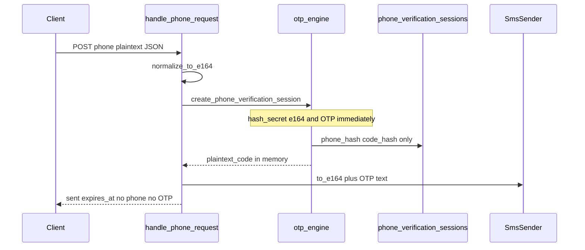

# 10. Обработка телефона при верификации (персональные данные / GDPR)

> **Назначение:** персистентная фиксация **фактов из кода** о том, какие данные о телефоне обрабатывает `doge-identity-service`, когда они в plaintext, когда только в виде хэша, как связаны с пользователем/email — для юридической ответственности (controller view) и копирования в privacy-политики.
> **Метод:** [`.cursor/rules/analysis.mdc`](../../../../.cursor/rules/analysis.mdc) — только проверяемые утверждения со ссылками на код; где поведения нет — явно «в коде нет».
> **Сверка с кодом:** 2026-08-10.
> **Не является** юридическим заключением и не заменяет DPA с SMS-провайдером; описывает as-built identity.

Связанные runtime-доки: [04-security](04-security.md) (HMAC), [05-data-model](05-data-model.md) (таблицы). Операционный SMS: [`sms-mock-testing.md`](../runbook/sms-mock-testing.md).

---

## 1. Категории данных (что вообще фигурирует)

| Категория | Форма | Где в identity | Статус в коде |
|-----------|--------|----------------|---------------|
| Номер телефона (E.164) | **plaintext** | HTTP body request/confirm; память handler; вход SMS-провайдера | эпhemeral на нашей стороне (см. §4) |
| OTP-код | **plaintext** | память после генерации; текст SMS | эпhemeral; в БД — только `code_hash` |
| Отпечаток номера | **HMAC-SHA256 hex** (`phone_hash` / `verified_phone_hash`) | `phone_verification_sessions`, `profiles` | персистентно |
| Отпечаток OTP | **HMAC-SHA256 hex** (`code_hash`) | `phone_verification_sessions` | персистентно (строка сессии) |
| Dial prefix | plaintext короткий префикс (напр. `+372`) | сессия + профиль | персистентно |
| Идентификатор пользователя | `supabase_user_id` (UUID) | сессия, профиль, audit | персистентно |
| Email | claim JWT / поле `/me` | **не** колонка phone-таблиц | отдельно от телефона (см. §5) |
| IP / User-Agent | только `ip_hash` / `user_agent_hash` в audit | `phone_audit_events` | персистентно; сырые IP/UA в audit **не** пишутся |

---

## 2. Алгоритм хэширования

Единая функция:

```9:11:src/core/security/hashing.py
def hash_secret(plaintext: str, *, key: str) -> str:
    """HMAC-SHA256 hex digest; key передаётся явно (без global state)."""
    return hmac.new(key.encode("utf-8"), plaintext.encode("utf-8"), hashlib.sha256).hexdigest()
```

| Параметр | Факт |
|----------|------|
| Алгоритм | **HMAC-SHA256**, результат — hex-строка |
| Библиотека | Python stdlib `hmac` + `hashlib` |
| Ключ (pepper) | `config.eid_secret` ← env **`DOGESTONIA_EID_SECRET`** ([`otp_engine.py:19-20`](../../src/core/phone/otp_engine.py), [`schema.py:160`](../../src/core/config/schema.py)) |
| Per-number salt | **в коде нет** — один и тот же ключ для всех номеров |
| Что хэшируется тем же ключом | E.164 номер, OTP-код ([`otp_engine.py:53-55`](../../src/core/phone/otp_engine.py)); IP/UA в audit ([04-security §9](04-security.md)) |

Ключ для OTP-движка:

```19:20:src/core/phone/otp_engine.py
def _hashing_key(config: AppConfig) -> str:
    return config.eid_secret or ""
```

Сверка кода при confirm использует `hmac.compare_digest` ([`otp_engine.py:27-29`](../../src/core/phone/otp_engine.py)).

---

## 3. Когда происходит хэширование (точки процесса)



### 3.1 `POST /auth/phone/request`

1. Plaintext `phone` в JSON → `normalize_to_e164` ([`handlers.py:469`](../../src/core/api/handlers.py)).
2. `create_phone_verification_session` **сразу** считает `phone_hash` и `code_hash`, затем `store.create` ([`otp_engine.py:49-63`](../../src/core/phone/otp_engine.py)):

```49:63:src/core/phone/otp_engine.py
    plaintext_code = _generate_otp_code(config.phone_code_length)
    session = PhoneVerificationSession(
        id=str(uuid.uuid4()),
        supabase_user_id=supabase_user_id,
        phone_hash=hash_secret(e164, key=key),
        dial_prefix=dial_prefix,
        code_hash=hash_secret(plaintext_code, key=key),
        status="started",
        attempts=0,
        created_at=current,
        expires_at=current + timedelta(seconds=config.phone_code_ttl_s),
        provider=provider,
        provider_message_id=None,
    )
    store.create(session)
    return session, plaintext_code
```

3. Plaintext E.164 + OTP уходят в SMS: `sender.send(to_e164=e164, text=…)` ([`handlers.py:504`](../../src/core/api/handlers.py)).
4. HTTP-ответ клиенту: `{sent, expires_at}` — **без** номера и кода ([`handlers.py:530-534`](../../src/core/api/handlers.py)).
5. Audit: `_log_phone_audit` — **без** телефона/OTP ([`handlers.py:112-140`](../../src/core/api/handlers.py), модель [`PhoneAuditEvent`](../../src/core/domain/models.py)).

### 3.2 `POST /auth/phone/confirm`

1. Снова plaintext `phone` + `code` в body.
2. Пересчёт `hash_secret(e164)` и сравнение с `session.phone_hash` ([`handlers.py:575-576`](../../src/core/api/handlers.py)).
3. При успехе: `mark_consumed` (статус, не удаление строки) + `subject_hash=hash_secret(e164)` → `profiles.verified_phone_hash` через `attach_phone_verification` ([`otp_engine.py:90-98`](../../src/core/phone/otp_engine.py), [`handlers.py:604-611`](../../src/core/api/handlers.py)).
4. Ответ: `{"status": "verified"}` ([`handlers.py:635`](../../src/core/api/handlers.py)).

### 3.3 После успешной верификации

В персистентном слое identity **нет** plaintext телефона — только `verified_phone_hash` и статусные поля на `profiles` ([миграция phone-колонок](../../supabase/migrations/20260611000001_profiles_phone_verification.sql)).

---

## 4. «Насколько быстро» — три разных окна (не смешивать)

| Вопрос | Ответ по коду |
|--------|----------------|
| **Когда** хэшируется относительно пайплайна? | Синхронно inline **до** `store.create` и **до** SMS; отложенной очереди хэширования **нет** |
| **Сколько CPU занимает HMAC?** | **Не измерено** в коде (нет таймеров/метрик). Операция выполняется внутри одного HTTP-handler на короткой E.164-строке. **Нельзя** утверждать «N мс» без бенчмарка |
| **Юридическое окно plaintext на стороне identity (память процесса)** | Пока живёт обработка HTTP-запроса request/confirm (локальные переменные `phone` / `e164` / `plaintext_code`). После ответа сервера plaintext номера в identity DB **не остаётся** |
| **TTL OTP (валидность кода)** | `expires_at = now + phone_code_ttl_s`; default **`PHONE_CODE_TTL_S=300`** (5 мин) ([`schema.py:243`](../../src/core/config/schema.py), [`otp_engine.py:59`](../../src/core/phone/otp_engine.py)). Это срок **действительности кода**, не авто-purge строки БД |
| **Долгоживущий отпечаток** | `profiles.verified_phone_hash` — до удаления пользователя (CASCADE) или смены привязки в коде |

---

## 5. Связь телефон ↔ пользователь ↔ email (ответственность)

```
JWT sub  →  UserClaims.supabase_user_id
                ↓
   phone_verification_sessions.supabase_user_id
   profiles.supabase_user_id  (+ verified_phone_hash после confirm)
                ↓
   email: claim JWT (supabase_validator) → поле /me
          НЕ пишется в phone_verification_sessions / phone-колонки profiles
```

Факты:

- Связь номера с аккаунтом — через **`supabase_user_id`**, не через email ([`PhoneVerificationSession`](../../src/core/domain/models.py), FK в [миграции sessions](../../supabase/migrations/20260626000001_phone_persistence_tables.sql:6-7)).
- Email парсится из JWT (`claims.get("email")`) в [`supabase_validator.py:67`](../../src/core/auth/supabase_validator.py) и отдаётся в [`me_response.py:21`](../../src/core/api/me_response.py).
- **Совместного хранения plaintext phone + email в одной записи identity нет.**
- Юридическая формулировка as-built: связь номера с email на стороне identity **опосредованная** — через идентификатор пользователя Supabase (`sub` / `supabase_user_id`).

Дедуп «один номер — один аккаунт» (если `PHONE_ONE_ACCOUNT_PER_NUMBER=true`, default): уникальный индекс / проверка по `verified_phone_hash` ([миграция](../../supabase/migrations/20260611000001_profiles_phone_verification.sql:11-13), [`schema.py:246`](../../src/core/config/schema.py)).

---

## 6. Персистентный слой (что лежит в БД)

### 6.1 `phone_verification_sessions`

[Миграция `20260626000001`](../../supabase/migrations/20260626000001_phone_persistence_tables.sql:3-26): `phone_hash`, `code_hash`, `supabase_user_id`, `dial_prefix`, статусы, `expires_at`, provider-поля. **Колонки plaintext phone нет.**

После успешного confirm: `mark_consumed` патчит только `status='consumed'` — **строка не удаляется** ([`db_supabase.py:818-827`](../../src/core/infrastructure/db_supabase.py)).

### 6.2 `profiles` (phone-поля)

[Миграция `20260611000001`](../../supabase/migrations/20260611000001_profiles_phone_verification.sql): `phone_verified`, `verified_phone_hash`, `phone_provider`, `phone_dial_prefix`, `phone_verified_at`. Модель [`ProfileRecord`](../../src/core/domain/models.py:34-38). **Plaintext phone нет.**

### 6.3 `phone_audit_events`

Поля: `supabase_user_id`, `event_type`, `provider`, `success`, `failure_reason`, `request_id`, `ip_hash`, `user_agent_hash` ([миграция](../../supabase/migrations/20260626000001_phone_persistence_tables.sql:39-53), [`PhoneAuditEvent`](../../src/core/domain/models.py:93-103)). **Нет** телефона, OTP, email.

### 6.4 API `GET /me`

Отдаёт `email` + phone **status** (`phone_verified`, `phone_provider`, `phone_dial_prefix`, `phone_verified_at`). **`verified_phone_hash` в ответ не включается** ([`me_response.py:17-51`](../../src/core/api/me_response.py)).

---

## 7. Сроки хранения / удаление (честно по коду)

| Механизм | В коде? | Поведение |
|----------|---------|-----------|
| TTL OTP (`PHONE_CODE_TTL_S`, default 300s) | Да | Истёкший код → ошибка `CODE_EXPIRED` / `mark_expired` при проверке; **не** означает DELETE строки |
| `expire_pending(now)` | Реализован в store | Вызовы есть в **тестах**; из application `src/` (handlers/cron) **не вызывается** |
| Purge audit | **Нет** | Insert-only |
| App-level GDPR erase API | **Не найден** | — |
| CASCADE при удалении `auth.users` | SQL | Sessions: `ON DELETE CASCADE` ([миграция](../../supabase/migrations/20260626000001_phone_persistence_tables.sql:6-7)); profiles — каскад с `auth.users` (см. create_profiles) |

**Нельзя утверждать** на основании этого репозитория: «сессии/audit автоматически удаляются через N дней».

---

## 8. Передачи третьим лицам / локальные sink’и

| Канал | Что уходит в plaintext | Retention в этом репо |
|-------|------------------------|------------------------|
| **Telnyx** | `to` = E.164, `text` = SMS с OTP ([`telnyx/sender.py:21-46`](../../src/core/phone/telnyx/sender.py)) | **Вне репо** (процессор SMS); текст: [`sms_text.py:4-5`](../../src/core/phone/sms_text.py) |
| **mock** | `(to_e164, text)` в `_sent` ([`mock_sender.py:23-25`](../../src/core/phone/mock/mock_sender.py)) | Память процесса до рестарта |
| **file** (dev) | Имя файла ≈ E.164; тело — timestamp + текст с OTP ([`file_sender.py:34-41`](../../src/core/phone/file/file_sender.py)) | Append-only на диск; **TTL/delete в коде нет**; **запрещён в `APP_PROFILE=pilot`** ([`schema.py:180`](../../src/core/config/schema.py)) |

---

## 9. Явные пробелы кода (NOT in code)

Для юристов / privacy copy — **нельзя** писать как реализованное, пока не появится код:

1. Отдельный salt на каждый номер.
2. Колонка plaintext phone в identity DB.
3. Совместное хранение email + phone в phone-сессии/phone-колонках профиля.
4. Измеренное время HMAC (мс).
5. Scheduled purge сессий / audit / file outbox.
6. Application GDPR erase endpoint (помимо SQL CASCADE при удалении user в Supabase).
7. Retention SMS у Telnyx (нужен их DPA / политика, не этот репозиторий).

---

## 10. Якоря кода (оглавление)

| Тема | Путь |
|------|------|
| HMAC | [`src/core/security/hashing.py`](../../src/core/security/hashing.py) |
| OTP + hash phone/code | [`src/core/phone/otp_engine.py`](../../src/core/phone/otp_engine.py) |
| HTTP handlers | [`src/core/api/handlers.py`](../../src/core/api/handlers.py) (`handle_phone_request`, `handle_phone_confirm`, `_log_phone_audit`) |
| `/me` payload | [`src/core/api/me_response.py`](../../src/core/api/me_response.py) |
| Email из JWT | [`src/core/auth/supabase_validator.py`](../../src/core/auth/supabase_validator.py) |
| Env TTL / secret | [`src/core/config/schema.py`](../../src/core/config/schema.py) |
| Модели | [`src/core/domain/models.py`](../../src/core/domain/models.py) |
| Supabase store / mark_consumed | [`src/core/infrastructure/db_supabase.py`](../../src/core/infrastructure/db_supabase.py) |
| Миграции | [`supabase/migrations/20260611000001_profiles_phone_verification.sql`](../../supabase/migrations/20260611000001_profiles_phone_verification.sql), [`20260626000001_phone_persistence_tables.sql`](../../supabase/migrations/20260626000001_phone_persistence_tables.sql) |
| Telnyx / file / mock | [`src/core/phone/telnyx/sender.py`](../../src/core/phone/telnyx/sender.py), [`file/file_sender.py`](../../src/core/phone/file/file_sender.py), [`mock/mock_sender.py`](../../src/core/phone/mock/mock_sender.py) |
