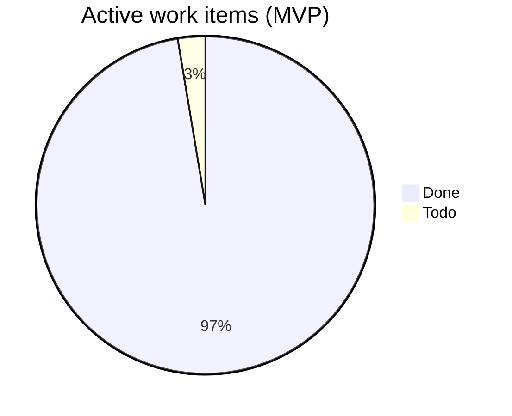

# Identity · scope dashboard

> **Scope-Id:** mvp  
> **Scope:** MVP  
> **SSOT:** package `INDEX.md` files + [bullrun-launch-index.md](bullrun-launch-index.md)  
> **Updated:** 2026-07-25  
> **Last change:** DOC-ONB-04 🟢 (SSOT `onboarding-waitlist.md`) — active **37/1 (97%)**; Remaining 1 (CLEANUP-04). Onboarding DOC-IDS 5/5. CAB-02 identity = **3/3**.  
> **Audit ([AUTHCORE-02](../analysis/identity-authcore-02-code-audit-2026-07-24.md)):** G3 🟢; G2 🟢 (SPA); G1 🟢 (ONB-01); G4 ignored.  
> **Audit ([ONB-01](../analysis/identity-onb-01-code-audit-2026-07-24.md)):** 🟢 Done по коду (406 pytest offline); статусы факт-верны (drift нет). F1–F3 = LOW (SPA обратный drift / `email_verified`-семантика / t04).

## Summary

| Metric | Value |
|--------|-------|
| Backlog packages | 9 |
| Active work items | 38 |
| Done | 37 |
| Todo | 1 |
| Deferred | 9 |
| **Overall progress (active)** | **97%** `████████████` |

*Active = 32 product stories Done + 1 Todo + 5 DOC-IDS Done. Deferred вне % (eid-deferred 5 + auth-bff 3 + SEC-05). Package table ниже — только stories.*

## By package

| Package | Stories | Done | Todo | Deferred | Progress |
|---------|---------|------|------|----------|----------|
| [auth-core](backlog-stories/auth-core/INDEX.md) | 2 | 2 | 0 | 0 | 100% `████████████` |
| [oauth](backlog-stories/oauth/INDEX.md) | 4 | 4 | 0 | 0 | 100% `████████████` |
| [eid](backlog-stories/eid/INDEX.md) | 7 | 7 | 0 | 0 | 100% `████████████` |
| [phone-verification](backlog-stories/phone-verification/INDEX.md) | 9 | 9 | 0 | 0 | 100% `████████████` |
| [cleanup](backlog-stories/cleanup/INDEX.md) | 4 | 3 | 1 | 0 | 75% `█████████░░░` |
| [security-hardening](backlog-stories/security-hardening/INDEX.md) | 7 | 6 | 0 | 1 | 100% `████████████` |
| [identity-onboarding](backlog-stories/identity-onboarding/INDEX.md) | 1 | 1 | 0 | 0 | 100% `████████████` |
| [eid-deferred](backlog-stories/eid-deferred/INDEX.md) | 6 | — | — | 5 | POST-MVP |
| [auth-bff](backlog-stories/auth-bff/INDEX.md) | 3 | — | — | 3 | POST-MVP |

*security-hardening: 6 Done active; SEC-05 Accumulating → Deferred (ADR; BFF in auth-bff). Package Progress = Done/(Done+Todo) without Deferred.*  
*eid-deferred: EID-02 Superseded (denom 0); EID-10…14 Deferred.*  
*story-draft-handoff aux DOC-DRAFT-05 Done — excluded from product counts.*  
*SPIKE-PV-08 / SPIKE-EID-09 — ops, excluded.*

## Remaining

| Type | Key | Title | Package/Epic | Status | Priority | Essence |
|------|-----|-------|--------------|--------|----------|---------|
| story | [CLEANUP-04](backlog-stories/cleanup/STORY-IDS-CLEANUP-04-spec-reconciliation.md) | Spec reconciliation | cleanup / EPIC-IDS-08 | Todo | P2 | Досверить или депрекейтнуть gateway-copy и eID-drift спеки |

## Doc-tasks Done (в active %)

| Key | Package | Evidence |
|-----|---------|----------|
| [DOC-IDS-ONB-01](backlog-stories/identity-onboarding/DOC-IDS-ONB-01-lazy-phone-gate-contract.md) | identity-onboarding | Done — pkg-000040 lazy phone gate |
| [DOC-IDS-ONB-02](backlog-stories/identity-onboarding/DOC-IDS-ONB-02-disclosure-copy.md) | identity-onboarding | Done — [`onboarding-copy.md`](../runbook/onboarding-copy.md) |
| [DOC-IDS-ONB-03](backlog-stories/identity-onboarding/DOC-IDS-ONB-03-gpt-verify-landing-contract.md) | identity-onboarding | Done — [`08-ui` §3c](../runtime-docs/08-ui-expectations.md) |
| [DOC-IDS-ONB-04](backlog-stories/identity-onboarding/DOC-IDS-ONB-04-non-ee-waitlist-spec.md) | identity-onboarding | Done — [`onboarding-waitlist.md`](../runbook/onboarding-waitlist.md) |
| [DOC-IDS-ONB-05](backlog-stories/identity-onboarding/DOC-IDS-ONB-05-runtime-docs-refresh.md) | identity-onboarding | Done — [`01-api.md`](../runtime-docs/01-api.md) synced 2026-07-09 |

## Epic rollup

| Epic | Status | Notes |
|------|--------|-------|
| EPIC-IDS-01…06 | Done | scaffold → testing |
| [EPIC-IDS-07](epics/EPIC-IDS-07-auth-core/EPIC-IDS-07-auth-core.md) | In Progress | AUTHCORE-01+02 🟢; epic gate pending |
| [EPIC-IDS-08](epics/EPIC-IDS-08-cleanup/EPIC-IDS-08-cleanup.md) | In Progress | CLEANUP-01…03 🟢; CLEANUP-04 ⚪ |
| EPIC-IDS-09 | Done | platform eID; real providers deferred |
| EPIC-IDS-10 | Done | PV-01…10; SPIKE-08 external |
| EPIC-IDS-11 | Done | OAUTH-01…04 |
| [EPIC-IDS-12](epics/EPIC-IDS-12-security-hardening/EPIC-IDS-12-security-hardening.md) | In Progress | SEC-01…04/06 🟢; SEC-05 Deferred (ADR → auth-bff) |
| [EPIC-IDS-13](epics/EPIC-IDS-13-onboarding/EPIC-IDS-13-onboarding.md) | In Progress | DOC-ONB-01…05 🟢; ONB-01 🟢; onboarding docs closed |

## Roadmap → 100%

**Текущая точка:** active **37/38 (97%)**. Product stories 32/33; DOC-IDS 5/5. DOC-ONB-04 🟢 closed. Next: `CLEANUP-04`.

| Цель | Знаменатель | Как закрыть |
|------|-------------|-------------|
| **Активные 100%** | 38 work items | 1 Remaining: CLEANUP-04 |
| **Полные 100%** | + 9 deferred | eid-deferred EID-10…14; auth-bff 01…03; SEC-05 BFF impl |

## §Now

1. [CLEANUP-04](backlog-stories/cleanup/STORY-IDS-CLEANUP-04-spec-reconciliation.md) — spec reconciliation.
2. Epic gates EPIC-IDS-07/08/12 (когда stories Done).

## §Deferred

- [SEC-05](backlog-stories/security-hardening/STORY-IDS-SEC-05-auth-credential-model-adr.md) — ADR Accumulating; реализация в [auth-bff](backlog-stories/auth-bff/INDEX.md).
- [EID-10…14](backlog-stories/eid-deferred/INDEX.md) — real Authentigate providers (POST-MVP).
- [AUTHBFF-01…03](backlog-stories/auth-bff/INDEX.md) — GoTrue BFF proxy (POST-MVP).

## Mermaid — completion

## How to refresh

1. Recount: package `INDEX.md` + DOC-IDS files (не из памяти).
2. Обновить этот файл по [`backlog-dashboard-template.md`](../../../docs/methodology/Zeya888-builder-queue/workflow/backlog-dashboard-template.md).
3. `npm run dashboard:aggregate`
4. [`backlog-dashboard-maintenance.md`](../../../docs/methodology/Zeya888-builder-queue/workflow/backlog-dashboard-maintenance.md)
